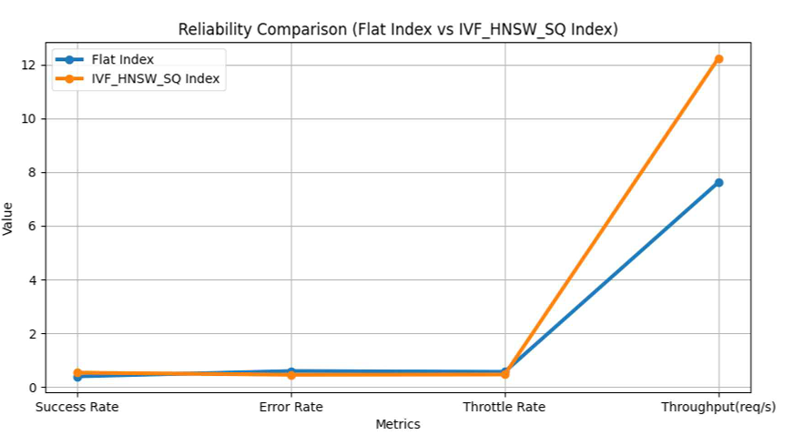

# Severless_RAG

Optimizing Search in Serverless Retrieval-Augmented Generation Systems
  

서버리스 기반 RAG 시스템의 검색 최적화

---

## 프로젝트 개요

**RAG (Retrieval-Augmented Generation)** 는 외부 지식베이스에서 관련 문서를 검색하여  
생성 모델의 입력으로 활용함으로써 최신 정보와 전문 지식을 반영한 답변을 제공합니다.  
이로 인해 질문응답(QA), 대화형 에이전트, 도메인 특화 검색 등 다양한 분야에서 활용되고 있습니다.  

RAG는 **Embedding → Retrieval → Re-ranking → Generation** 으로 이어지는 다단계 처리 구조를 가지며,  
질문 데이터의 품질과 관련성, 생성 결과의 정확성과 사실적 정합성 등  
단계별로 중점 요소가 다릅니다.  

그러나 **서버리스 환경(Serverless Environment)** 에서의 RAG는  
이러한 생성 품질뿐 아니라 **콜드 스타트 지연, 함수 체이닝으로 인한 네트워크 비용,  
원격 스토리지 접근으로 인한 추가 지연** 등 인프라적 요인이  
전체 성능과 운영 효율성에 결정적인 영향을 미칩니다.  

특히 **Retrieval 단계**는 RAG 파이프라인의 핵심 병목 구간으로,  
AWS 기반 실험에서 전체 런타임의 약 **61%** 가 Retrieval에 소요된다고 밝혔으며,  
해당 단계가 전체 latency의 **40% 이상** 을 차지한다고 학계에서는 보고했습니다.  
따라서 **검색 단계의 인덱스 최적화**는 전체 RAG 시스템의  
실시간성, 비용 효율성, 신뢰성에 직접적으로 기여할 수 있습니다.

---

## 프로젝트 목적

본 프로젝트는 완전 **서버리스(Serverless)** 환경에서  
**RAG 파이프라인의 Retrieval 단계를 최적화**하기 위해 설계되었습니다.  

이 프로젝트는 **AWS Lambda, API Gateway, S3, Step Functions, Bedrock, LanceDB** 기반으로 구성되며,  
**Flat Index**와 **IVF_HNSW_SQ Index**를 비교하여  
벡터 인덱스 변경이 **성능·신뢰성·비용**에 미치는 영향을 정량적으로 분석하였습니다.  

또한 **in-memory 기반 서버리스 RAG 구조**로서  
최소한의 리소스 소비로도 효율적인 검색을 수행할 수 있는 구조를 제공합니다.  
즉, **본 코드는 메모리 기반 검색 구조를 최적화한 서버리스 RAG 오픈소스 프레임워크입니다.**

Retrieval 단계에서는 **LanceDB**를 사용하여 벡터 인덱싱 및 검색을 수행하며,  
Flat Index(선형 탐색)과 IVF_HNSW_SQ Index(근사 최근접 탐색, Approximate Nearest Neighbor) 간의 차이를 실험적으로 검증했습니다.  

**IVF_HNSW_SQ Index**는 다음의 세 가지 기법을 결합하여  
속도·정확도·효율 간의 균형을 갖춘 인덱싱 알고리즘입니다.  
- **IVF (Clustering):** 탐색 범위를 사전 축소하여 불필요한 메모리 접근 감소  
- **HNSW:** 그래프 구조 기반의 고속 근사 최근접 탐색  
- **SQ (Scalar Quantization):** float32 벡터를 정수 기반으로 근사화하여 메모리 절감  

---

  

> Amazon API Gateway → Lambda → Step Functions → Bedrock → LanceDB → S3  
> CloudWatch 및 X-Ray를 통한 전체 지연·비용 추적 구조

SRAG_BENCH는 **엔드포인트 단위로 완전히 분리된 서버리스 RAG 파이프라인**입니다.  
각 단계는 개별 **Lambda 엔드포인트**로 동작하며,  
**AWS Step Functions**가 전체 흐름을 제어합니다.

| 구성 요소 | 역할 | 설명 |
|------------|------|------|
| **API Gateway** | 요청 라우팅 | 클라이언트 요청을 수신하여 Lambda로 전달 |
| **Baseline Endpoint** | 오케스트레이션 | Retrieval과 Generation 단계를 순차 호출하며 상태 관리 |
| **Retrieval Lambda Endpoint** | 벡터 검색 처리 | Bedrock Titan Embed Text v2로 임베딩 생성 → LanceDB에서 Top-K 검색 수행 |
| **Generation Lambda Endpoint** | 응답 생성 | Bedrock Claude 3.5 Sonnet을 호출해 최종 답변 생성 |
| **Step Functions** | 제어 흐름 관리 | 두 Lambda 단계를 연결하여 RAG 파이프라인 실행 |
| **S3 / LanceDB** | 데이터 계층 | 전처리 코퍼스, 인덱스, 결과 캐시 저장 |

> 전체 파이프라인은 **Baseline → Retrieval → Generation** 순으로 호출되며,  
> 각 Lambda 함수는 개별 엔드포인트로 실행되어 완전한 **서버리스 오케스트레이션**을 구현합니다.

---

## 검색단계 구성

  

Retrieval 단계는 **서버리스 RAG 파이프라인의 핵심 구간**으로,  
질문으로부터 벡터 임베딩을 생성하고 이를 기반으로 Top-K 문서를 검색하는 과정을 수행합니다.  
본 프로젝트에서는 **LanceDB**를 활용하여 **Flat Index**와 **IVF_HNSW_SQ Index**의 성능을 비교하였습니다.

---

### Lambda 기반 검색 흐름

Lambda 핸들러는 각 요청(Request)에 대해 다음의 메트릭을 **CloudWatch** 및 **AWS X-Ray**에 자동 기록합니다.  
- 검색에 소요된 시간  
- 전체 지연(latency)  
- 콜드 스타트 여부  
- 함수 실행별 비용 추정치  

이러한 방식으로 모든 기능을 **엔드포인트 단위로 분리·구현**하여,  
Baseline 구조를 완전 서버리스 환경에서 재현할 수 있도록 설계하였습니다.

> 각 엔드포인트는 AWS API Gateway를 통해 호출되며,  
> Lambda 내부에서 단계별로 Retrieval 및 Generation 과정을 수행합니다.

---

### 요청 처리 절차

1. **질문 요청 전달**  
   API Gateway를 통해 클라이언트의 질문 텍스트가 Lambda 함수로 전달됩니다.

2. **임베딩 생성 (Titan Embed Text v2)**  
   Lambda 내부에서 Amazon Bedrock Titan Embed Text v2 모델을 호출하여  
   입력 질문을 벡터 형태로 변환(Embedding)합니다.

3. **벡터 검색 (LanceDB)**  
   생성된 임베딩 벡터를 LanceDB에 전달하여, 저장된 코퍼스 데이터와의  
   **코사인 유사도(Cosine Similarity)** 를 기반으로 **Top-K 유사 문서**를 검색합니다.

4. **인덱스 방식 비교 실험**  
   동일한 질문셋과 동일한 환경에서  
   - **Flat Index (선형 탐색)**  
   - **IVF_HNSW_SQ Index (근사 최근접 탐색)**  
   두 가지 인덱스 방식을 각각 적용하여 성능·비용·확장성을 정량적으로 분석합니다.

5. **결과 수집 및 로그 집계**  
   모든 요청의 평균 응답 시간, 처리량, 비용, 신뢰성 지표를 CloudWatch 로그로 집계하여  
   인덱싱 방식별 효율성을 비교합니다.

---

### 실험 설계 개요

이 실험은 **점진적 트래픽 부하(gradual traffic injection)** 를 주어  
안정된 평균값이 수렴할 때까지 실행되었습니다.  
질문셋은 무작위로 선택되어 Retrieval 단계의 Lambda 엔드포인트에 전달되며,  
각 호출은 독립적으로 수행되어 서버리스의 확장성과 병렬성을 검증합니다.  

이 방식은 **검색 성능·확장성·신뢰성**을 동시에 평가할 수 있는 구조로,  
RAG 시스템의 Retrieval 단계 최적화 효과를 실증적으로 분석하기 위한  
표준화된 벤치마크 흐름으로 설계되었습니다.

---

## 주의사항 및 고려점

1️. **질문셋과 코퍼스 데이터의 일관성**이 충분히 확보되지 않을 경우  
검색 정확도 및 응답 품질이 저하될 수 있으며,  
이는 실험 결과의 일반화 가능성을 제한할 수 있습니다.  

2️.  **임베딩 모델의 차이**는 결과에 직접적인 영향을 미칩니다.  
동일한 질문이라도 사용한 임베딩 모델의 구조와 학습 데이터 특성에 따라  
벡터 표현이 상이하게 형성되어 성능 편차가 발생할 수 있습니다.  

이 프로젝트는 서버리스 환경에서도 효율적인 벡터 검색 전략이 중요함을 보여주며,  
향후 클라우드 기반 RAG 시스템의 설계·운영 전략 수립에 있어  
**Retrieval 단계의 최적화**가 가장 중요한 고려 요소임을 실증적으로 입증합니다.

---

## 성능 결과

### 1️. 요청별 지연시간 분포

  

> IVF_HNSW_SQ Index는 일부 요청이 1초 이내로 빠르게 종료되며  
> 평균 지연은 크게 줄었지만, 분산이 다소 증가하였습니다.

---

### 2️. 신뢰성 비교

  

> **IVF_HNSW_SQ Index**는  
> - 성공률 상승  
> - 에러율 및 Throttle 비율 감소  
> - 처리량(Throughput) 약 1.7배 향상  

---

## 결론 및 참고사항 

Retrieval 단계에서는 **검색 시간 단축이 최우선 목표**였으며,  
서버리스 환경에서는 **비용 절감까지 고려한 효율적인 알고리즘 선택**이 필수적입니다.  
본 프로젝트에서 사용한 **클러스터링 결합 인덱스(IVF_HNSW_SQ)** 는  
이러한 목적에 매우 효과적임을 실험적으로 확인했습니다.  

다만, **메모리 기반 검색**은 높은 성능을 제공하지만  
자원 소모가 크다는 한계가 있습니다.  
따라서 **대규모 데이터셋이나 트래픽 증가 상황**에서는  
**디스크 기반 검색 및 메모리 절감형 하이브리드 인덱스**의 적용이 필요합니다.  

또한 **Vector DB를 OpenSearch로 변경**하여  
인덱스 저장·검색을 통합 관리하고,  
AWS Serverless 환경에서의 **확장성과 안정성**을 검증하는 것도  
좋은 후속 방향이 될 것입니다.  

하지만 사용자가 서버리스 환경에서 RAG를 구현할 시에는  
**목적, 용도, 데이터 규모에 따라 올바른 선택**을 해야 합니다.

---

  Maintained by <a href="https://github.com/yourname">유소민 (Somin Yoo)</a> | Severless_RAG 2025 ©

